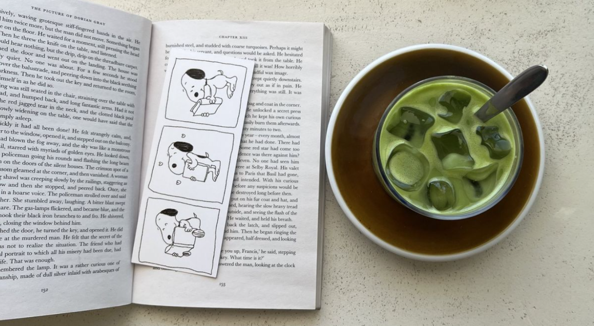
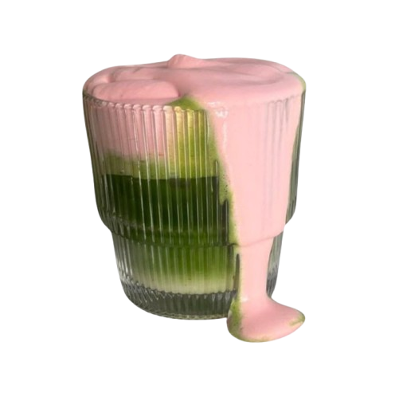

---

<h1 align="center">Hi there, I'm Izza 𓍢🌷͙֒ </h1>
<h3 align="center">a.k.a <a href="https://github.com/Opullenceee">@Opullenceee</a></h3>

Computer Science student based in Pakistan

  
  
  
  

---

<table width="100%" style="width:100%; border:3px solid; border-radius:20px; border-collapse:collapse; background-color:transparent;">

<tr>

<td width="35%" align="center" valign="middle" style="padding:40px; border-right:3px solid;">

</td>

<td width="65%" valign="middle" style="padding:40px;">

<h2 style="margin-top:0; font-family:Arial,sans-serif; font-size:36px;">

⋆𐙚 ̊. A little about me

</h2>

I'm a CS student who got tired of ideas looking boring, so I taught myself to make them not boring. Most days that means designing interfaces in Figma, breaking and fixing them in HTML/CSS/JS, and occasionally convincing Python to do what I want. I'm chasing a future in AI, one small project (and one large coffee) at a time.

<h3>Fun facts .⋆❀°</h3>

<ul>

<li>I take "meh" ideas and give them a whole aesthetic glow-up (that's kind of my whole thing).</li>

<li>Coffee is basically my second IDE. Nothing compiles without it.</li>

<li>I build random little projects for no reason other than "can I make this exist" such as desktop widgets, tiny tools, whatever's living in my head that week.</li>

</ul>

</td>

</tr>

</table>

---

### 𖹭 Tech stack

---

#⠀⋆˚꩜｡<b> GitHub Stats:</b>

 

---

<table width="100%" style="width:100%; border:3px solid; border-radius:20px; border-collapse:collapse; background-color:transparent;">

<tr>

<td width="35%" align="center" valign="middle" style="padding:40px; border-right:3px solid;">

</td>

<td width="65%" valign="middle" style="padding:40px;">

<h2 style="margin-top:0; font-family:Arial,sans-serif; font-size:36px;">

✮⋆˙Current Projects

</h2>

<ul style="font-size:22px; line-height:2.2; font-family:Arial,sans-serif;">

<li>Calendar Widget</li>
<li>Music Player Widget</li>
<li>Pomodoro Timer Widget</li>
<li>Weather Widget</li>
<li>Cinefind</li>

</ul>

</td>

</tr>

</table>

---

𐙚⋆°🦢｡⋆♡ scanning for aesthetics since forever

